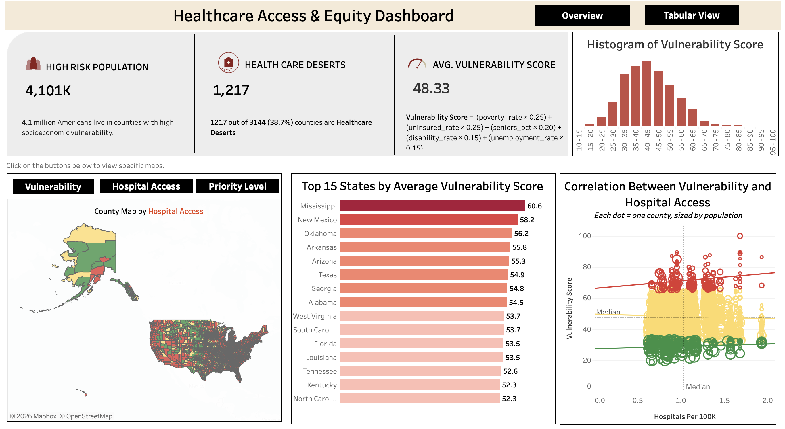
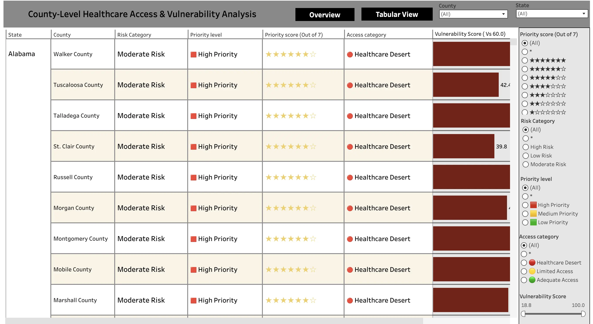

# Healthcare Access & Equity Analysis

**[View Live Dashboard on Tableau Public →](https://public.tableau.com/views/HealthcareAccessEquityAnalysis/Dashboard32?:language=en-US&:sid=&:redirect=auth&:display_count=n&:origin=viz_share_link)**

> Comprehensive analysis of healthcare accessibility disparities across 3,144 US counties, combining socioeconomic vulnerability data with hospital infrastructure metrics to identify high-priority intervention areas.



---
## Project Overview

This project addresses a critical healthcare challenge: **4.1 million Americans live in counties with high socioeconomic vulnerability, and many of these areas also lack adequate hospital access, creating a dual burden.**

### Objectives

1. **Identify** counties with high socioeconomic vulnerability using CDC data
2. **Measure** healthcare infrastructure accessibility across all US counties
3. **Prioritize** intervention areas combining vulnerability and access metrics
4. **Visualize** findings through interactive geospatial dashboards

### Business Impact

- **Resource Allocation**: Helps policymakers prioritize healthcare infrastructure investments
- **Health Equity**: Identifies communities facing the greatest barriers to care
- **Data-Driven Decisions**: Provides quantitative metrics for intervention planning
---
## Key Findings

### Summary Statistics

| Metric | Value | Insight |
|--------|-------|---------|
| **Total Counties Analyzed** | 3,144 | 100% US coverage (all 50 states + DC) |
| **Healthcare Deserts Identified** | 1,217 counties (38.7%) | Significant populations with severely limited access |
| **High-Risk Population** | 4.1 million people | 1.2% of US population in high-risk counties |
| **Average Vulnerability Score** | 48.33% | Population-weighted national average |

### Geographic Insights

**Highest Vulnerability Regions:**
1. **Southern States**: Mississippi (60.61), New Mexico (58.17), Oklahoma (56.22)
2. **Appalachian Region**: Arkansas (55.79), Eastern Kentucky, West Virginia
3. **Rural Southwest**: Arizona, Texas border counties

**Key Patterns:**
- High Priority counties are concentrated in **Southern States** (41% of total)
- Characterized by **high vulnerability scores (40-68)** combined with **low hospital density (<1.5 per 100k)**
- Affecting large rural and urban populations (50,000-400,000 per county)

### Vulnerability-Access Correlation

- **Statistically significant negative correlation** between vulnerability and hospital access
- Counties with vulnerability scores >60 have 43% fewer hospitals per capita than national average
- However, **hospital density alone doesn't fully explain vulnerability**—social determinants matter
---

## Technical Methodology

### 1. Vulnerability Score Construction

**Formula:**
```python
Vulnerability Score = (
    (poverty_rate × 0.25) +
    (uninsured_rate × 0.25) +
    (seniors_pct × 0.20) +
    (disability_rate × 0.15) +
    (unemployment_rate × 0.15)
) / max_raw_score × 100
```

**Rationale:**
- **Variables already on 0-100 scale** (percentages) → No z-score normalization needed
- **Domain-informed weights** reflecting healthcare access impact:
  - **Poverty & Uninsured (50%)**: Direct financial barriers to care
  - **Seniors (20%)**: Higher healthcare utilization needs
  - **Disability (15%)**: Healthcare dependency
  - **Unemployment (15%)**: Economic stability affecting health access
- **Min-max normalization to 0-100** for interpretability

**Implementation:**
```
0-33: Low Risk
33-66: Medium Risk
66-99: High Risk
```

---
### 2. Healthcare Desert Definition

**Classification Criteria:**

| Category | Criteria | Rationale |
|----------|----------|-----------|
| **Healthcare Desert** | hospitals_per_100k < 2 AND<br>population > 20,000 | Severe access limitation + significant affected population |
| **Limited Access** | hospitals_per_100k < 5 AND<br>population > 10,000 | Below-average access + moderate population |
| **Adequate Access** | All others | Meets or exceeds national benchmarks |

**Benchmark Context:**
- **National median**: ~4 hospitals per 100k residents
- **Healthcare Desert threshold (< 2)**: Less than half the national median
- **Population floor (20k)**: Focuses on areas with substantial affected populations

**Important Note:**
> Hospital access metrics are calculated at the **STATE level** due to CMS data structure limitations. All counties within a state show the same hospitals per 100k value. This provides valid **interstate comparisons** while acknowledging that **intrastate variation** (rural vs urban within a state) is not captured.

---

### 3. Priority Scoring System

**Scoring Logic:**

| Component | Points | Rationale |
|-----------|--------|-----------|
| **High Risk Vulnerability** | +3 | Severe socioeconomic barriers |
| **Moderate Risk** | +2 | Significant challenges |
| **Low Risk** | +1 | Baseline consideration |
| **Healthcare Desert** | +3 | Severe infrastructure gap |
| **Limited Access** | +2 | Below-average infrastructure |
| **Large Population (>50k)** | +1 | Bonus for scale of impact |

---

## Project Structure
```
healthcare-equity-analysis/
├── data/
│   ├── raw/              # Raw data from APIs
│   └── processed/        # Cleaned datasets
├── scripts/              # Colab notebooks
├── tableau/              # Dashboard files
├── docs/                 # Documentation
│   ├── images            # Tableau Dashboards
│  
└── README.md
```

## Visualizations

### Dashboard 1: Equity and Access Dashboard


**Components:**
- 3 KPI Cards (High-Risk Population, Healthcare Deserts, Average Vulnerability Score)
- Vulnerability Score Histogram
- Interactive County Map (Vulnerability, Hospital Access, Priority Level)
- Top 15 States Ranking
- Hospital Access vs. Vulnerability Scatter Plot
- Dashboard Navigation (Overview & Tabular View)


### Dashboard 2: Detailed Analysis


**Components:**
- County-Level Analysis Table
    - Displays state, county, risk category, priority level, priority score, healthcare access category, and vulnerability score.
- Priority Score Visualization
    - Seven-star rating system used to rank counties based on intervention priority.
- Healthcare Access Classification
    - Categorizes counties as Healthcare Desert, Limited Access, or Adequate Access.
- Risk & Priority Indicators
    - Color-coded labels highlighting county risk category and intervention priority level.
- Interactive Filters
    - Filter by State, County, Priority Score, Risk Category, Priority Level, Access Category, and Vulnerability Score range.
- Dashboard Navigation
    - Overview and Tabular View buttons for switching between dashboard pages.

---

#Author
**Sai Lohith Chimbili**  

## References

1. CDC/ATSDR Social Vulnerability Index. (2022). *County-level vulnerability data*. Retrieved from https://www.atsdr.cdc.gov/placeandhealth/svi/
2. Centers for Medicare & Medicaid Services. (2023). *Hospital Compare datasets*. Retrieved from https://data.cms.gov/

</div>
